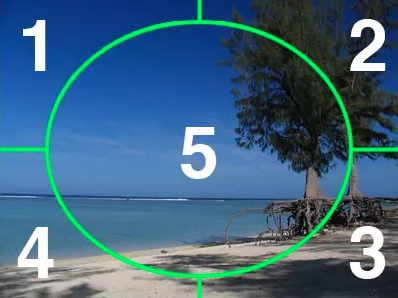
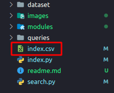

# 1. Cấu trúc thư mục:
* `dataset`: chứa các hình ảnh dùng để xây dựng nên hệ thống CBIR.
* `queries`: chứa các query image
* `modules`: chứa các class, phương thức.
* `index.py`: dùng để xây dựng nên các feature vector, xây dựng indexing và file `index.csv`.
* `search.py`: dùng để search các ảnh từ query image.
* `index.csv`: lưu các feature vector của các image trong `dataset`.

# 2. Cách hoạt động
* Mỗi một image trong `dataset` sẽ được chia thành 5 phần như hình sau:

<center>

  

</center>

* Tiếp theo, ta sẽ tính histogram cho từng phần 1, 2, 3, 4, 5 trong hình và nối năm histogram này thành một `List[int]`.
* Tiếp theo ta sẽ normalize theo min-max scaler, lúc này mỗi phần tử trong `List[int]` có giá trị nằm trong ngưỡng $[0, 1]$.
* Khi ta tiến hành search từ một query image, nó sẽ chuyển query image này thành một feature vector, tiếp theo nó tiến hành tính toán khoảng cách **Chi-square distance** của query image với từng feature vector nằm trong file `index.csv`.
* Theo **Chi-square distance**, nếu giá trị càng gần $0$ thì hai hình khả năng cao là giống nhau nên ta mặc định của chương trình này sẽ lấy ra 10 hình có giá trị thấp nhất.

# 3. Demo
## 3.1. Xây dựng file indexing
* Nếu như chưa có file `index.csv`:
  
  <center>

    

  </center>
  
  hoặc khi `dataset` của ta có sự thay đổi, thì ta cần phải tính toán lại các feature vector, sử dụng lệnh sau:
    ```shell
    python3 index.py --dataset dataset --index index.csv
    ```

    trong đây:
      - `index.py`: là file chạy để xây dựng các feature vector và tạo file `index.csv`
      - `--dataset dataset`: là cờ dùng để chỉ định folder chứa các image database, ở đây database image là `dataset`.
      - `--index index.csv`: cờ `--index` là tên muốn đặt cho file để lưu các feature vector, ở đây là `index.csv`.

## 3.2. Tìm kiếm trên CBIR
* Nếu như file `index.csv` đã tồn tại, để search dùng lệnh dưới đây:
  ```shell
  python3 search.py --index index.csv --query queries/cdmc900.jpg --result-path dataset
  ```
  trong đây:
    \- `search.py`: là file dùng để chạy chức năng tìm kiếm.
    \- `--index index.csv`: chỉ định file lưu các feature vector, ở đây là file `index.csv`.
    \- `--query queries/cdmc900.jpg`: là đường dẫn đến image cần tìm kiếm, ở đây query image nằm tại `queries/cdmc900.jpg`.
    \- `--result-path dataset`: chỉ định thư mục chứa các hình ảnh tương ứng cho từng feature vector trong file `index.csv`, ở đây là thư mục `dataset`. Lưu ý nếu `dataset` thay đổi thì phải quay lại bước **3.1** để xây dựng lại file `index.csv`.

* Sau khi chạy lên trên, nó sẽ hiện ra query image và result image được CBIR tìm ra trong `dataset`, nhấn **ENTER** để xem result image tiếp theo, mặc định là có 10 result image được đề ra.

# 4. Tài liệu tham khảo
* [https://www.pyimagesearch.com/2014/12/01/complete-guide-building-image-search-engine-python-opencv/](https://www.pyimagesearch.com/2014/12/01/complete-guide-building-image-search-engine-python-opencv/)